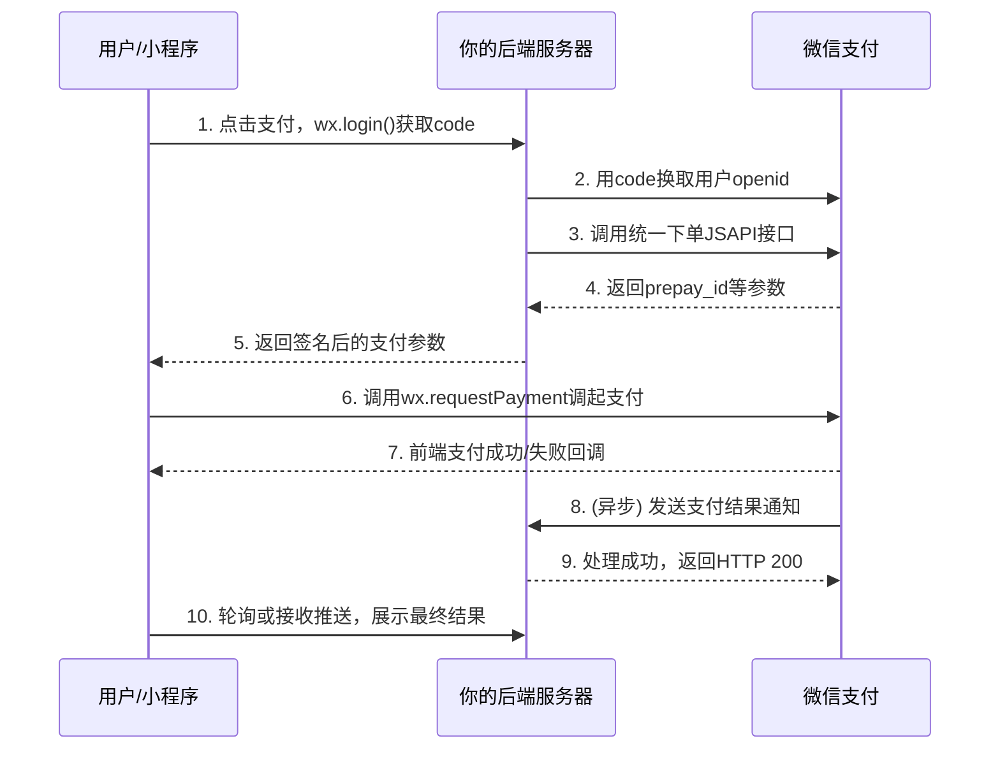

# 微信小程序支付接入完全指南

本文旨在为开发者提供一份清晰、完整的小程序支付接入指南，涵盖了从资质准备、后台配置到前后端开发的完整流程，并特别指出关键配置与避坑要点。

---

## 一、核心概念与资质准备

小程序支付属于 **JSAPI 支付**的一种，其运行环境限定在微信内，因此与商户号是“强绑定”关系。

### 1.1 必备资质清单

在开始开发前，请确保你已具备以下全部资质，缺一不可：

| 资质项             | 具体要求                               | 备注与说明                                 |
| :----------------- | :------------------------------------- | :----------------------------------------- |
| **主体资质**       | 企业或个体工商户的营业执照             | 个人主体小程序**无法**开通支付功能。       |
| **微信小程序**     | 一个**已认证**的企业类小程序           | 需缴纳300元认证费，完成主体认证。          |
| **微信支付商户号** | 已开通 **JSAPI 支付** 产品权限的商户号 | 主体需与小程序一致，或已完成“异主体授权”。 |
| **服务器与域名**   | 已备案的**HTTPS**域名及后端服务器      | 用于接收小程序请求和微信支付回调。         |

### 1.2 商户号类目与资质

商户号申请时需选择经营类目，资质要求如下：

- **普通商品/服务**：仅需营业执照，且经营范围需覆盖所选类目。
- **特殊行业**：需提供额外行政许可证。
  - **食品/餐饮**：《食品经营许可证》
  - **教育**：《办学许可证》
  - **旅游**：《旅行社业务经营许可证》

> **提示**：接入支付**完全不需要**使用“微信小店”。微信小店是独立的SaaS店铺工具，而你是在进行自主开发，直接调用微信支付API即可。

---

## 二、后台配置：商户平台 + 小程序后台

支付接入涉及两个后台的配置，分工明确，切勿混淆。

### 2.1 第一步：微信支付商户平台配置

这里是资金和安全的配置中心。

1.  **申请商户号**：访问 https://pay.weixin.qq.com，提交资料入驻，经营场景选择“**小程序**”。
2.  **配置API密钥与证书**（**安全核心，务必谨慎**）：
    - **API v3密钥**：【账户中心】→【API安全】中设置。设为32位随机字符串，**设置后无法查看**，请妥善保管。
    - **申请API证书**：同上页面，下载证书工具，生成并下载商户证书（`.pem` 和 `.key` 文件）。这是后端调用支付接口的“身份证”。
3.  **绑定小程序AppID**：【产品中心】→【APPID账号管理】中，输入你的小程序AppID，提交绑定申请。

### 2.2 第二步：微信小程序后台配置

这里是授权和网络白名单的配置中心。

1.  **确认支付绑定**：【微信支付】→【商户号管理】中，查看并“确认”来自商户平台的绑定邀请，完成授权。
2.  **配置服务器域名**：【开发】→【开发设置】→【服务器域名】中，在 **`request` 合法域名** 项添加你后端接口的HTTPS域名（例如：`https://api.yourdomain.com`）。

> **权限流总结**：商户平台发起绑定 → 小程序后台确认授权 → 绑定完成。

---

## 三、开发流程与接口调用

### 3.1 整体交互时序图



### 3.2 后端开发核心任务

你的服务器是支付链路的安全中枢，负责与微信支付交互。

1.  **统一下单**
    - 接收小程序前端传来的用户临时 `code` 和订单信息。
    - 用 `code` 调用微信接口换取用户唯一标识 `openid`。
    - 使用**商户证书**，调用 `https://api.mch.weixin.qq.com/v3/pay/transactions/jsapi` 接口下单，关键参数包括 `appid`、`mchid`、`openid`、`notify_url`（回调地址）。
    - 收到包含 `prepay_id` 的响应后，按规则进行二次签名，将签名后的参数包返回给前端。

2.  **支付回调（Notify URL）处理**（**重中之重**）
    - 在统一下单时传入的 `notify_url` 必须是**公网HTTPS**地址。
    - 当用户支付完成，微信会向该地址发送 **POST** 请求。
    - **你必须**：
      a. **验签**：校验请求头 `Wechatpay-Signature`，确保通知来自微信。
      b. **解密**：使用API v3密钥解密报文，获得真实订单状态。
      c. **幂等处理**：根据商户订单号 `out_trade_no` 防止重复处理。
      d. **快速响应**：处理成功后，必须在**5秒内**返回HTTP 200，否则微信会重复通知。

3.  **订单状态查询与补单**
    - 提供接口供前端轮询订单状态。
    - 当网络问题导致未收到回调时，后端应能主动调用微信查单接口进行状态同步。

### 3.3 前端（小程序）开发核心任务

小程序端主要负责收集信息和调起支付面板。

1.  **获取用户授权**：使用 `wx.login()` 获取 `code`，并发送给后端。
2.  **请求支付参数**：调用后端统一下单接口，传递 `code`、订单号、金额（单位：**分**）等信息。
3.  **调起支付**：收到后端返回的签名参数后，调用 `wx.requestPayment(Object object)`。
4.  **处理结果**：在 `success` 和 `fail` 回调中给用户即时反馈，**但最终状态需依赖后端回调确认**。

**前端示例代码：**

```javascript
// 1. 获取code
wx.login({
  success: (res) => {
    // 2. 请求后端下单
    wx.request({
      url: "https://api.yourdomain.com/pay/unifiedorder",
      method: "POST",
      data: { code: res.code, orderId: "123", amount: 100 }, // 金额100分
      success: (orderRes) => {
        const payArgs = orderRes.data;
        // 3. 调起微信支付
        wx.requestPayment({
          timeStamp: payArgs.timeStamp,
          nonceStr: payArgs.nonceStr,
          package: payArgs.package, // 格式为 prepay_id=wx123...
          signType: "RSA",
          paySign: payArgs.paySign,
          success: () => {
            /* 前端支付成功提示 */
          },
          fail: (err) => {
            console.error("支付失败", err);
          },
        });
      },
    });
  },
});
```

---

## 四、避坑指南与常见问题

1.  **`fail: {errMsg: "requestPayment:fail [支付签名错误]"}`**
    - **原因**：支付参数签名错误、`package` 格式错误、商户号与小程序未绑定。
    - **排查**：检查后端签名算法、确保 `package` 值为 `prepay_id=xxx` 格式、确认商户平台绑定关系。

2.  **金额单位错误**
    - 小程序前端和后端交互时，金额单位必须是**分**（整数）。例如1元 = 100。

3.  **本地开发与测试**
    - 支付回调（`notify_url`）必须为公网HTTPS，本地测试需使用 **ngrok** 或 **frp** 等工具进行内网穿透。
    - 确保小程序后台的“服务器域名”已正确配置测试环境的域名。

4.  **安全提醒**
    - **切勿**将商户号、API密钥、证书文件等硬编码在前端代码中。
    - 所有涉及密钥和签名的操作必须在后端进行。
    - 支付成功状态**必须以微信异步通知（notify）为准**，不能仅信赖前端回调。

---

## 五、总结流程清单

1.  **准备资质**：认证小程序 → 申请对应类目的商户号。
2.  **配置后台**：商户平台设置API密钥/证书 → 绑定小程序AppID → 小程序后台确认授权并配置服务器域名。
3.  **后端开发**：实现统一下单接口 → 实现支付回调接口（做好验签、解密、幂等）→ 实现查单接口。
4.  **前端开发**：调用 `wx.login` → 请求后端获取支付参数 → 调用 `wx.requestPayment`。
5.  **测试上线**：使用沙箱或小额真实交易测试完整流程 → 部署上线。

遵循以上步骤，你就能系统地完成微信小程序支付的接入。关键在于理解两个后台的分工，以及后端在安全验签和异步通知处理中的核心作用。
