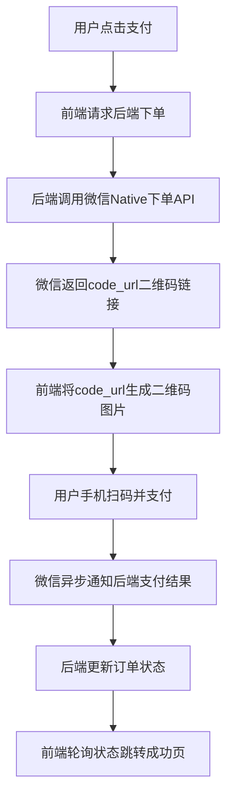

针对 PC 端微信支付（通常指用户坐在电脑前，用手机扫码支付的场景），最主流且稳妥的方案是 **Native 支付**（原生支付）。JSAPI 支付在 PC 端限制较多（需微信内置浏览器），一般不推荐。

以下是完整的接入拆解：

## 一、必备资质清单（硬门槛）

在写代码前，请先核对是否满足以下条件，否则无法通过审核：

| 资质项            | 具体要求                                   | 备注                                   |
| :---------------- | :----------------------------------------- | :------------------------------------- |
| **主体资质**      | 企业、个体工商户、事业单位等（需营业执照） | 个人无法申请商户号                     |
| **公众号/小程序** | 已认证的服务号（推荐）或小程序             | 用于绑定商户号，获取 AppID             |
| **域名备案**      | 网站必须已完成 **ICP 备案**                | 备案主体需与商户号主体一致或提供授权函 |
| **商户号**        | 微信支付商户号（需签署协议）               | 入驻时需选择“PC 网站”场景              |

> **注意**：如果你的网站域名备案主体和公司营业执照不一致（例如用了集团域名或第三方建站平台），需要额外准备 **《网站授权函》**，否则会被驳回 。

## 二、官方参考文档（开发必看）

建议按顺序查阅，避免走弯路：

1.  **Native 支付产品介绍**：了解原理和适用场景。
    - URL: `https://pay.weixin.qq.com/docs/merchant/apis/native-payment/introduction.html`
2.  **Native 支付快速开始**：完整的参数申请和开发流程。
    - URL: `https://pay.weixin.qq.com/docs/merchant/apis/native-payment/quick-start.html`
3.  **PC 网页方案接入指引**：专门针对 PC 场景的注意事项。
    - URL: `https://pay.weixin.qq.com/docs/partner/guides/pc-web-solution/access-guide/intro.html`

## 三、接入流程（从 0 到 1）

### 阶段一：后台配置（非开发）

1.  **注册并认证服务号**：在微信公众平台注册，并缴纳 300 元认证费完成认证。
2.  **申请商户号**：登录 pay.weixin.qq.com，提交营业执照等资料入驻，申请时经营场景务必勾选“PC 网站” 。
3.  **绑定与授权**：在商户平台“产品中心”开通 **Native 支付** 权限，并将商户号与你的服务号 AppID 进行绑定授权 。
4.  **配置密钥**：在商户平台“API 安全”中设置 API v3 密钥，并下载**商户证书**（.pem 文件）。这是后端调支付接口的“身份证”，务必保密 。

### 阶段二：开发交互流程（Native 支付）

PC 端支付的核心逻辑是：**前端生成二维码 -> 用户手机扫码 -> 后端监听回调**。



## 四、前端开发具体任务

前端在 PC 支付中主要负责“展示”和“状态同步”，不涉及敏感密钥操作。

| 任务              | 技术实现                                                           | 注意事项                                       |
| :---------------- | :----------------------------------------------------------------- | :--------------------------------------------- |
| **1. 触发下单**   | 用户点击支付按钮，调用后端创建订单接口。                           | 传递商品信息（金额、标题、订单号）。           |
| **2. 渲染二维码** | 接收后端返回的 `code_url`，使用 **qrcode.js** 等库生成二维码图片。 | `code_url` 是支付链接，有效期为 2 小时 。      |
| **3. 轮询状态**   | 展示二维码后，前端定时（如每 3 秒）查询后端订单状态。              | 建议使用 WebSocket 或长轮询，避免频繁请求。    |
| **4. 结果跳转**   | 当轮询到支付成功（或失败）时，自动跳转至结果页面。                 | 不要依赖前端直接判断，必须以后端状态为准。     |
| **5. 异常处理**   | 处理二维码过期（超时）、网络错误、用户取消等场景。                 | 过期后需隐藏旧二维码，提供“刷新”按钮重新下单。 |

### 代码片段示例（伪代码）

```javascript
// 1. 调用后端下单接口
const res = await fetch("/api/create-order", { method: "POST" });
const { code_url, order_id } = await res.json();

// 2. 生成二维码（使用 qrcode.js 库）
const qrcode = new QRCode(document.getElementById("qrcode"), {
  text: code_url,
  width: 200,
  height: 200,
});

// 3. 轮询支付状态
const timer = setInterval(async () => {
  const statusRes = await fetch(`/api/check-order?order_id=${order_id}`);
  const data = await statusRes.json();

  if (data.status === "SUCCESS") {
    clearInterval(timer);
    window.location.href = "/pay-success"; // 跳转成功页
  }
}, 3000);
```

## 五、避坑指南

1.  **域名白名单**：在商户平台配置“支付域名”时，不要带 `http://`，只需填 `yourdomain.com` 。
2.  **证书问题**：后端调用微信 API 必须使用**商户证书**进行签名。开发环境注意处理好证书路径，生产环境建议将证书内容放在环境变量中，不要硬编码在代码里。
3.  **回调公网IP**：微信异步通知（`notify_url`）必须是一个**公网可访问**的 HTTPS 接口，本地开发环境（localhost）无法接收回调，需使用内网穿透工具（如 ngrok）进行测试。
